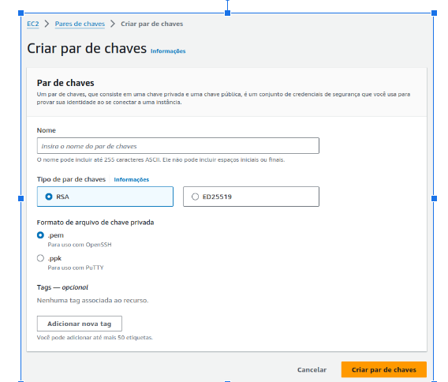

# Atividade_Aws_Linux_Compass
## Requisitos AWS: 
Gerar uma chave pública para acesso ao ambiente; Criar 1 instância EC2 com o sistema operacional Amazon Linux 2 (Família t3.small, 16 GB SSD); Gerar 1 elastic IP e anexar à instância EC2; Liberar as portas de comunicação para acesso público: (22/TCP, 111/TCP e UDP, 2049/TCP/UDP, 80/TCP, 443/TCP).

## Requisitos no linux: 
Configurar o NFS entregue;

Criar um diretório dentro do filesystem do NFS com seu nome; 

Subir um apache no servidor - o apache deve estar online e rodando; 

Criar um script que valide se o serviço está online e envie o resultado da validação para o seu diretório no nfs; 

O script deve conter - Data HORA + nome do serviço + Status + mensagem personalizada de ONLINE ou offline;

O script deve gerar 2 arquivos de saida: 1 para o serviço online e 1 para o serviço OFFLINE; 

Preparar a execução automatizada do script a cada 5 minutos.

## Instruções de Execução da Atividade
## AWS >> Geração de chave pública
* Acessar a AWS na página do serviço EC2, e clicar em "Pares de chaves" no menu lateral esquerdo.
* Clicar em "Criar par de chaves".
* A tela de criação será aberta e nela você poderá escolher um nome para o par de chaves.

 

 # AWS >> Criação de uma VPC
* Acessar a AWS na página do serviço VPC, e clicar em "Criar VPC";
* Atribua um nome a sua VPC;
* Especifique um bloco CIDR IPv4 para sua VPC;
* Feito isso, basta clicar em Criar VPC.

* # AWS >> Criar 1 instância EC2 com o sistema operacional Amazon Linux 2 (Família t3.small, 16 GB SSD) 
* No Painel EC2 no console AWS, clique em Instâncias no menu ao lado esquerdo da tela e clique em “Executar instância”;
* Configurar as Tags da instância (Name, Project e CostCenter) para instâncias e volumes;
* Selecionar a imagem Amazon Linux 2 AMI (HVM), SSD Volume Type.
* Selecionar o tipo de instância t3.small.
* Selecionar a chave gerada anteriormente.
* Em configurações de Rede, selecione a opção Criar Grupo de segurança;
* Ainda nessa seção, deixe marcada a opção Permitir tráfego SSH de Qualquer Lugar (0.0.0.0/0);
* Colocar 16 GB de armazenamento gp2 (SSD).
* Clicar em "Executar instância".
* Revise se as configurações estão de acordo com as recomendações dos instrutores e clique em “Executar Instância”.

# AWS >> Criando Gateway de Internet
* No console da AWS acesse a página do serviço VPC, e clique em "Gateways de internet" no menu lateral esquerdo.
* Clicar em "Criar gateway de internet".
* Definir um nome para o gateway e clicar em "Criar gateway de internet".
* Selecionar o gateway criado e clicar em "Ações" > "Associar à VPC".
* Selecionar a VPC da instância EC2 criada anteriormente e clicar em "Associar".
